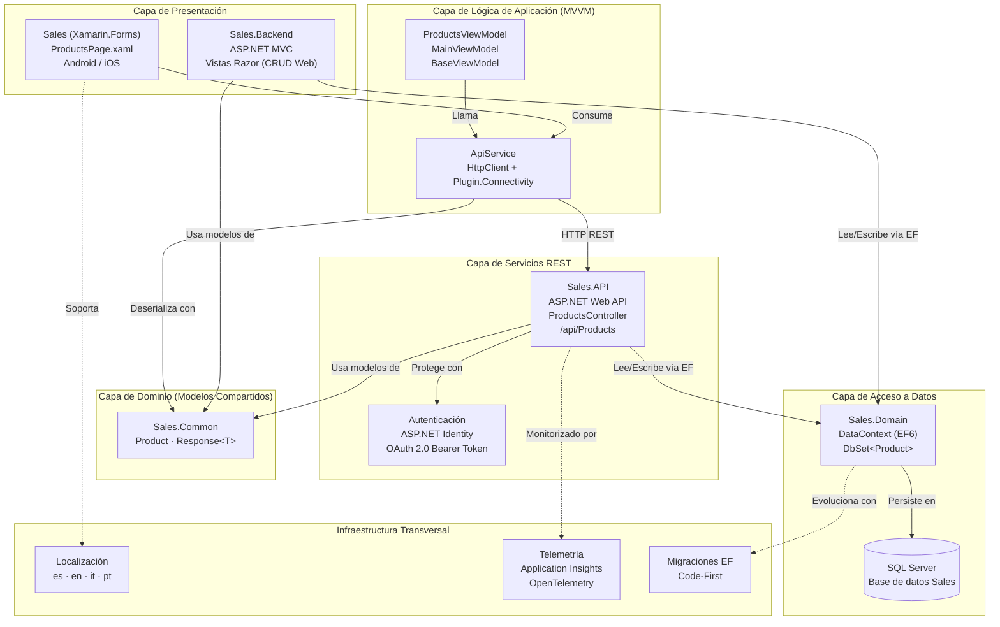

# Sales - Sistema de Gestión de Productos

Aplicación full-stack para la gestión y consulta de productos, compuesta por una API REST, un panel de administración web y una aplicación móvil multiplataforma.

## Arquitectura del Proyecto

La solución está organizada en cinco proyectos que conforman una arquitectura en capas:

```
Sales/
├── Sales.Common      # Modelos compartidos entre todos los proyectos
├── Sales.Domain      # Contexto de base de datos (Entity Framework)
├── Sales.API         # API REST (ASP.NET Web API)
├── Sales.Backend     # Panel de administración web (ASP.NET MVC)
└── Sales/            # Aplicación móvil (Xamarin.Forms)
    ├── Sales         # Proyecto compartido (lógica y UI)
    ├── Sales.Android # Proyecto Android
    └── Sales.iOS     # Proyecto iOS
```

## Diagrama de Capas



## Proyectos

### Sales.Common
Biblioteca de clases con los modelos compartidos:
- **`Product`** – Entidad principal del sistema.
- **`Response`** – Objeto genérico de respuesta para las llamadas a la API (`IsSuccess`, `Message`, `Result`).

### Sales.Domain
Capa de acceso a datos:
- **`DataContext`** – DbContext de Entity Framework conectado a SQL Server (`DefaultConnection`), expone el DbSet `Products`.

### Sales.API
API REST construida con ASP.NET Web API:
- Expone endpoints CRUD completos para productos (`GET`, `POST`, `PUT`, `DELETE`).
- Incluye autenticación mediante ASP.NET Identity y OAuth (token bearer).
- Ruta base: `/api/Products`

### Sales.Backend
Panel de administración web construido con ASP.NET MVC:
- Interfaz CRUD completa para administrar productos desde el navegador.
- Autenticación y gestión de usuarios con ASP.NET Identity.
- Migraciones automáticas de Entity Framework.

### Sales (Xamarin.Forms)
Aplicación móvil multiplataforma (Android e iOS):
- Consume la API REST a través de `ApiService` usando `HttpClient`.
- Patrón de arquitectura **MVVM** con MVVM Light.
- `ProductsViewModel` gestiona la lista de productos con soporte para pull-to-refresh.
- Soporte de **localización/internacionalización** (idiomas configurables).
- Verificación de conectividad antes de llamadas a la API.

## Tecnologías Utilizadas

| Capa | Tecnología |
|---|---|
| API REST | ASP.NET Web API (.NET Framework) |
| Web Admin | ASP.NET MVC (.NET Framework) |
| Base de datos | SQL Server + Entity Framework 6 |
| Autenticación | ASP.NET Identity + OAuth 2.0 |
| Móvil | Xamarin.Forms (Android / iOS) |
| MVVM móvil | MVVM Light |
| Serialización | Newtonsoft.Json |
| Conectividad | Plugin.Connectivity |

## Funcionalidades Principales

- Listado de productos desde la API REST.
- Alta, edición y baja de productos desde el panel web.
- Visualización de productos en la app móvil con actualización manual (pull-to-refresh).
- Manejo de errores de red con mensajes al usuario.
- Sistema de autenticación con registro e inicio de sesión.

## Requisitos Previos

- Visual Studio 2017 o superior
- .NET Framework 4.x
- SQL Server (LocalDB o instancia completa)
- Xamarin instalado (para el proyecto móvil)
- Android SDK / Xcode (para compilar los proyectos nativos)

## Configuración

1. Clonar el repositorio.
2. Abrir `Sales.sln` en Visual Studio.
3. Configurar la cadena de conexión `DefaultConnection` en `Web.config` de `Sales.API` y `Sales.Backend`.
4. Ejecutar las migraciones de Entity Framework o habilitar `AutomaticMigrationsEnabled = true` (ya configurado).
5. Actualizar la URL base de la API en los recursos de la app Xamarin (`UrlAPI`, `UrlPrefix`, `UrlProductsController`).
6. Establecer `Sales.API` y `Sales.Backend` como proyectos de inicio múltiple.
